# 🚀 Đồ án DevOps / DevSecOps Thực Chiến (Intern & Fresher)
> **Tên đồ án:** *Automated Multi-Environment GitOps Deployment & Observability Platform*  
> **Mục tiêu:** Xây dựng luồng CI/CD/GitOps hoàn chỉnh từ source code đến Kubernetes cluster, kết hợp quét bảo mật (DevSecOps), hạ tầng dạng mã (IaC) và giám sát tập trung (Observability).

---

## 🏗️ 1. Kiến Trúc Tổng Thể & Tech Stack

```mermaid
flowchart LR
    Dev[Developer] -->|Push Code| RepoApp[App Repository]
    
    subgraph CI["1. CI & DevSecOps Pipeline (GitHub Actions)"]
        RepoApp --> LintTest[Lint & Unit Test]
        LintTest --> Sonar[SonarQube/SonarCloud Scan]
        Sonar --> Trivy[Trivy Vulnerability Scan]
        Trivy --> DockerBuild[Multi-Stage Docker Build]
        DockerBuild --> PushImage[Push to Container Registry ECR/GHCR]
        PushImage --> UpdateManifest[Update Image Tag in Config Repo]
    end

    subgraph CD["2. GitOps Continuous Delivery (ArgoCD)"]
        RepoConfig[Config / Helm Repo] -->|Track Changes| ArgoCD[ArgoCD Controller]
        UpdateManifest -.->|Auto Commit| RepoConfig
        ArgoCD -->|Sync & Deploy| K8s[Kubernetes Cluster]
    end

    subgraph Monitoring["3. Observability & Alerting"]
        K8s --> Prometheus[Prometheus: Metrics]
        K8s --> Loki[Loki: Logs]
        Prometheus --> Grafana[Grafana Dashboard]
        Loki --> Grafana
        Prometheus --> Alertmanager[Alertmanager]
        Alertmanager --> Alert[Telegram / Discord Alert]
    end
```

### Tech Stack Chi Tiết:
* **Ứng dụng mẫu**: 3-Tier Web App (Frontend React/Vue + Backend Node.js/Go/Python + PostgreSQL/Redis).
* **Containerization**: Docker (Multi-stage build, Non-root user, Alpine base).
* **CI / DevSecOps**: GitHub Actions (hoặc GitLab CI), SonarCloud, Trivy.
* **Registry**: GitHub Container Registry (GHCR) hoặc Docker Hub / AWS ECR.
* **IaC**: Terraform (Quản lý VPC, Security Group, EC2 / EKS, Remote State trên S3 + DynamoDB).
* **GitOps & Orchestration**: ArgoCD + Kubernetes (K3s/Minikube hoặc Managed K8s/EKS).
* **Observability**: Prometheus + Grafana + Loki/Promtail + Alertmanager.

---

## 📋 2. Chi Tiết Các Giai Đoạn Triển Khai

### Giai đoạn 1: Containerization & Tối Ưu Hóa (Docker)
* **Multi-stage build**: Tách giai đoạn `build` (chứa SDK, compiler) và `production` (chỉ chứa runtime & binary/artifact) để giảm kích thước image từ hàng GB xuống còn vài chục MB.
* **Bảo mật Container**: Chạy dưới quyền non-root user (`USER nonroot` hoặc `USER 1001`), không dùng tag `:latest`.
* **Local Testing**: Viết `docker-compose.yml` để dễ dàng kiểm thử toàn bộ stack (Frontend, Backend, Database) ở máy local.

### Giai đoạn 2: CI & DevSecOps Pipeline (GitHub Actions / GitLab CI)
Xây dựng pipeline kích hoạt tự động khi tạo Pull Request hoặc Push lên branch `main`:
1. **Linting & Test**: Chạy linter kiểm tra code style và unit tests.
2. **SAST (Static Application Security Testing)**: Quét code với **SonarQube / SonarCloud** để phát hiện bugs, code smells, và lỗ hổng bảo mật.
3. **Container & Dependency Scanning**: Dùng **Trivy** quét các lỗ hổng CVEs nghiêm trọng (CRITICAL, HIGH) trong dependencies và Docker image.
4. **Build & Release**: Build Docker image, tag theo Git Commit SHA (`sha-${{ github.sha }}`) hoặc Semantic Versioning, sau đó đẩy lên Registry.
5. **Trigger GitOps**: Tự động tạo commit/PR cập nhật tag mới vào repository cấu hình K8s.

### Giai đoạn 3: Infrastructure as Code (Terraform)
* Khởi tạo hạ tầng tự động (VPC, Subnets, VM/Cluster K8s, Firewall).
* **Remote State Management**: Cấu hình Terraform Remote Backend (S3 Bucket + DynamoDB State Locking) để tránh conflict khi làm việc nhóm.
* Tách biệt môi trường bằng `workspaces` hoặc thư mục `environments/dev`, `environments/prod`.

### Giai đoạn 4: GitOps & Triển Khai CD (ArgoCD + Kubernetes)
* **Mô hình GitOps**: Tách riêng 2 repository:
  * `repo-app`: Chứa source code ứng dụng và pipeline CI.
  * `repo-gitops`: Chứa K8s manifests / Kustomize / Helm Charts.
* **ArgoCD**: Cài đặt trong cluster K8s, tự động đồng bộ (Auto-sync & Self-heal) khi repo cấu hình thay đổi.
* **Tài nguyên K8s cần có**:
  * `Deployment` & `Service` (ClusterIP/NodePort).
  * `Ingress` (Nginx Ingress Controller + TLS/Cert-Manager).
  * `ConfigMap` & `Secret` (Dùng Sealed Secrets hoặc External Secrets Operator).
  * `HorizontalPodAutoscaler` (HPA) tự động scale theo CPU/RAM.

### Giai đoạn 5: Monitoring, Logging & Alerting (Observability)
* **Prometheus**: Thu thập số liệu hệ thống (Node Exporter, Kube-State-Metrics) và metrics của ứng dụng.
* **Grafana**: Xây dựng dashboard trực quan theo dõi: CPU/RAM usage, Request per second (RPS), Latency, Error Rate (HTTP 4xx/5xx).
* **Promtail + Loki**: Thu thập và truy vấn log tập trung từ các Pods.
* **Alertmanager**: Thiết lập cảnh báo và gửi thông báo tức thời về **Telegram / Discord / Slack** khi có sự cố (Pod crash/restart, High memory usage > 85%, Ingress down).

---

## 🎯 3. Những Điểm Nhấn Phỏng Vấn (Ghi Điểm Tuyệt Đối)

1. **Tại sao chọn GitOps (ArgoCD) thay vì Deploy từ CI qua SSH / `kubectl apply`?**
   * *Trả lời:* Tăng tính bảo mật (CI không cần giữ quyền admin cluster), dễ rollback bằng Git History, tự động phục hồi cấu hình (Self-healing).
2. **Quản lý Secrets như thế nào?**
   * *Trả lời:* Không commit plaintext secret lên Git. Sử dụng Sealed Secrets, Mozilla SOPS, hoặc AWS Secrets Manager tích hợp qua External Secrets Operator.
3. **Cách tối ưu Docker Image?**
   * *Trả lời:* Dùng Multi-stage build, base image siêu nhẹ (Alpine/Distroless), tận dụng layer caching hiệu quả, giảm thiểu số lượng `RUN` layer.
4. **Kinh nghiệm Troubleshooting thực tế:**
   * Chuẩn bị sẵn câu chuyện về cách bạn debug lỗi: Ví dụ `CrashLoopBackOff`, `OOMKilled` (do thiếu memory limit), lỗi DNS resolve giữa các services, hoặc cấu hình Ingress Routing.

---

## 📅 4. Lộ Trình Thực Hiện Từng Tuần (4 - 6 Tuần)

| Tuần | Mục Tiêu Chính | Kết Quả Đạt Được |
| :--- | :--- | :--- |
| **Tuần 1** | App & Dockerization | App chạy ngon lành trên local qua Docker Compose, Dockerfile chuẩn Multi-stage. |
| **Tuần 2** | CI & Security Scanning | GitHub Actions tự động build, scan SonarCloud + Trivy, push image lên GHCR. |
| **Tuần 3** | Hạ tầng & K8s Manifests | Viết Terraform tạo hạ tầng; viết Helm chart / K8s manifests hoàn chỉnh. |
| **Tuần 4** | CD với GitOps | Dựng ArgoCD, kết nối GitOps repo, tự động sync khi có image mới. |
| **Tuần 5** | Observability & Alerting | Setup Prometheus + Grafana dashboard + Loki; cấu hình Alert về Telegram. |
| **Tuần 6** | Documentation & Showcase | Hoàn thiện file README, vẽ diagram kiến trúc, quay video demo/chụp ảnh đính kèm vào CV. |
